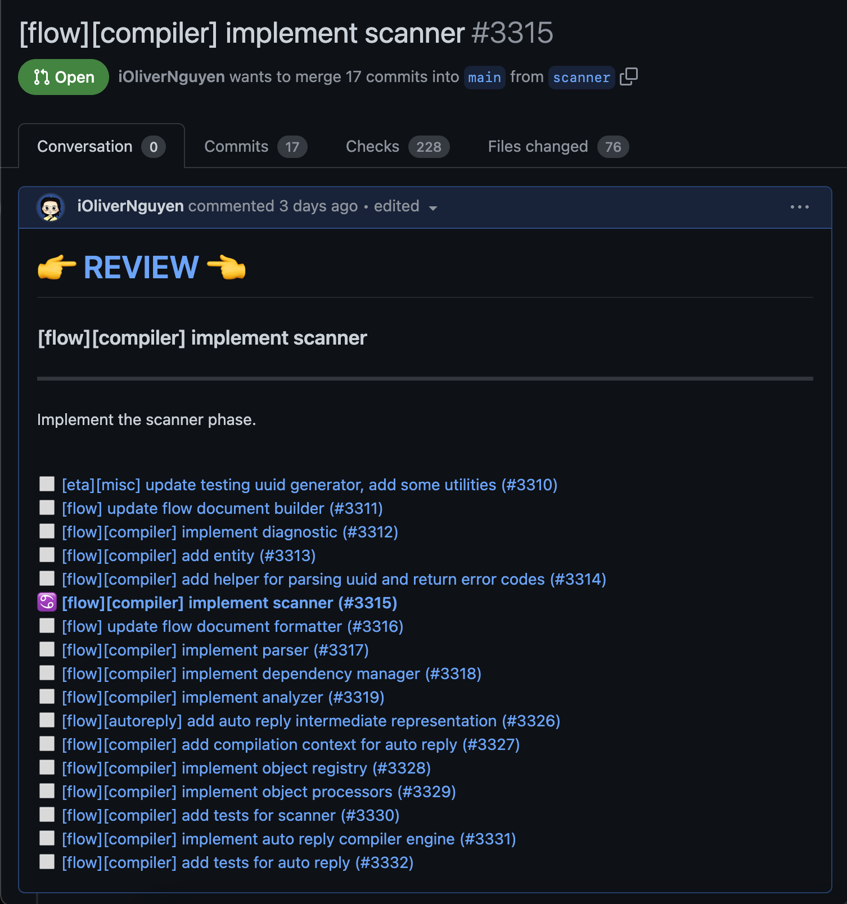

# git-pr

`git-pr` is a command line tool to create and update GitHub pull requests within stacked commits.

While working with stacked commits, we need to make change and push these commits to GitHub. Because a stack of commits
has many commits, pushing them all to GitHub requires multiple invocations of `git push`, one for each commit, which is
tedious. `git-pr` helps you to push all commits to GitHub and create stacked pull requests, one for each commit. The
reviewers can review each PR by clicking the 👉 **REVIEW** 👈 link, which point to the corresponding commit for that
PR. Read more at [the introduction article](https://olivernguyen.io/w/stacked.prs).



## Installation

### Download

- Install [github-cli](https://cli.github.com/) and run `gh login`.
- Install [git-branchless](https://github.com/arxanas/git-branchless) and run `git branchless init`.
- Install git-pr, build, and add to your `$PATH`

  ```sh
  git clone https://github.com/Talor-A/git-pr
  cd git-pr
  ./build.sh
  ```

## Usage

```sh
git checkout [commit]
git pr
```

Check out the last commit in your stacked commits and call `git pr` to push the stack to GitHub, one PR for each commit.
PRs will be opened as draft by default.

### Arguments

```sh
$ git-pr --help
Usage: git pr [options]
  -default-tags string
    	Set default tags for the current repository (comma separated)
  -gh-hosts string
    	Path to config.json (default "~/.config/gh/hosts.yml")
  -include-other-authors
    	Create PRs for commits from other authors (default to false: skip)
  -main string
    	Main branch name (default "main")
  -remote string
    	Remote name (default "origin")
  -t string
    	Set tags for current stack, ignore default (comma separated)
  -timeout int
    	API call timeout in seconds (default 20)
  -v	Verbose output
```

### Tags/Labels

#### Set default tags/labels for all PRs:

**Note**: These tags/labels must exist in your GitHub repository.

```sh
git pr -default-tags 'backend,api'
```

You can override default tags/labels for the current stack by passing `-t`:

```sh
git pr -t 'frontend,bug'
```

#### Add tags/labels for each PR:

You can set different tags/labels for each PR by adding `Tags:` at the end of the commit message:

```
commit message body

Tags: bug, p0
```

## How it works

- It associates each commit with a pull request by adding `Remote-Ref: <remote-branch>` to the commit message.
- It push each commit to GitHub and create or update the corresponding pull request.
- It detects the login user from [github-cli](https://cli.github.com/).
- It adds a list of all PRs for that stack at the end of each PR.

## License

MIT

## Author

forked from [Oliver Nguyen](https://github.com/iOliverNguyen/git-pr)